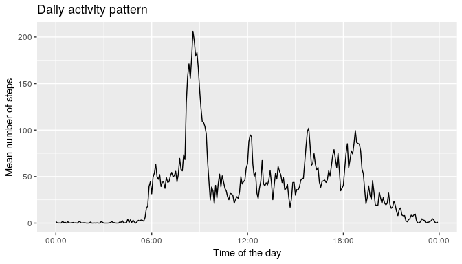

```r
# Loading required libraries for this study
library(dplyr)
library(ggplot2)
```


## Loading and preprocessing the data


```r
# This script assumes that activity.zip is available in the current directory
unzip("activity.zip")

activityData <- tbl_df(read.csv("activity.csv", header = TRUE)) %>%
    mutate(time_interval =
               as.POSIXct(strptime(paste(date, sprintf("%04d", interval)),
                                   format = "%Y-%m-%d %H%M")),
           day = as.Date(date))
```


## What is the mean total number of steps taken per day?

First we calculate the total number of steps taken per day.


```r
# Summarize total of steps by day
totalStepsByDay <- activityData %>%
    group_by(day) %>%
    summarize(total_steps = sum(steps))
```

Then we make a histogram of the total number of steps taken each day.


```r
ggplot(totalStepsByDay, aes(total_steps)) +
    geom_histogram(na.rm = TRUE, bins = 5, color = "black", fill = "white") +
    labs(title = "Histogram of total steps per day",
         x = "Total number of steps",
         y = "Number of days")
```

<!-- -->

Next we calculate and report the mean and median.


```r
meanStepsPerDay <- mean(totalStepsByDay$total_steps, na.rm = TRUE)
medianStepsPerDay <- median(totalStepsByDay$total_steps, na.rm = TRUE)
```

Ignoring missing values, the mean of the total number of steps taken per day was
**10766.19** while the median was
**10765**.


## What is the average daily activity pattern?

We summarize the data by the 5-minute interval.


```r
# Summarize total of steps by the interval
meanStepsByInterval <- activityData %>%
    group_by(interval) %>%
    summarize(mean_steps = mean(steps, na.rm = TRUE)) %>%
    mutate(interval_time =
               as.POSIXct(strptime(sprintf("%04d", interval),
                                   format = "%H%M")))
```

Then we make a time series plot of the average number of steps taken on each 5-minute interval.


```r
ggplot(meanStepsByInterval, aes(interval_time, mean_steps)) +
    geom_line(na.rm = TRUE) +
    scale_x_datetime(date_labels = "%H:%M") +
    labs(title = "Daily activity pattern",
         x = "Time of the day",
         y = "Mean number of steps")
```

<!-- -->


```r
mostActiveInterval <- filter(meanStepsByInterval, mean_steps == max(mean_steps))
stepsInMostActiveInterval <- mostActiveInterval$mean_steps
mostActiveTime <- format.Date(mostActiveInterval$interval_time, "%H:%M")
```

On average across all days in the dataset, the most active 5-minute interval is
the one that starts at **08:35**, with an average of
**206.17** steps taken.


## Imputing missing values

Calculate the number of missing values in the dataset.


```r
rowsWithNA <- sum(!complete.cases(activityData))
missingSteps <- sum(is.na(activityData$steps))
missingDate <- sum(is.na(activityData$date))
missingInterval <- sum(is.na(activityData$interval))
```

We see that there are **2304** rows with missing values. In particular,
we have 2304 missing values on the steps variable, 0
missing from date and 0 missing from interval.

We create a new dataset in which we replace those missing values for the mean
steps (across all days) taken on the corresponding 5-minute interval.


```r
# Function that returns steps if not missing, or else the mean for the interval
getMeanStepsForIntervalIfMissing <- function(steps, interval) {
    if (is.na(steps)) {
        meanStepsByInterval[meanStepsByInterval$interval == interval, ]$mean_steps
    } else {
        steps
    }
}

# Replaces missing data on a new dataset using the function defined above
activityDataImputed <- activityData %>%
    mutate(steps = mapply(getMeanStepsForIntervalIfMissing,
                          activityData$steps,
                          activityData$interval))

totalStepsByDayImputed <- activityDataImputed %>%
    group_by(day) %>%
    summarize(total_steps = sum(steps))
```

Now we compare with the original dataset to assess the impact. First, comparing
the histogram of the total number of steps taken each day.


```r
ggplot(totalStepsByDayImputed, aes(total_steps)) +
    geom_histogram(na.rm = TRUE, bins = 5, color = "black", fill = "white") +
    labs(title = "Histogram of total steps per day with the imputed dataset",
         x = "Total number of steps",
         y = "Number of days")
```

<!-- -->

Now for the mean and median.


```r
meanStepsPerDayImputed <- mean(totalStepsByDayImputed$total_steps, na.rm = TRUE)
medianStepsPerDayImputed <- median(totalStepsByDayImputed$total_steps, na.rm = TRUE)
```

With imputed data, the mean of the total number of steps taken per day changed
from **10766.19** to
**10766.19** while the median
changed from **10765** to
**10766.19**.

In conclusion, the impact of imputing missing data was really small.

## Are there differences in activity patterns between weekdays and weekends?


